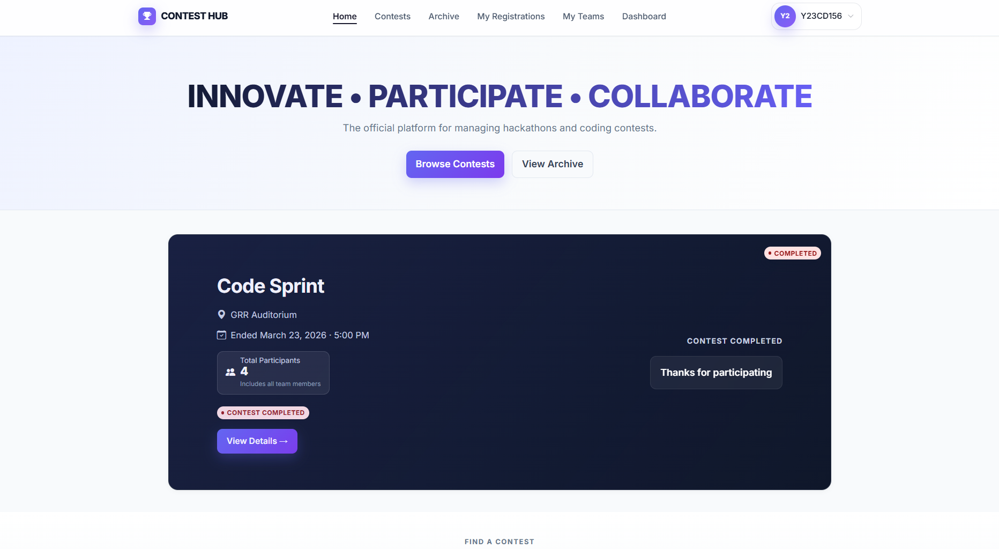
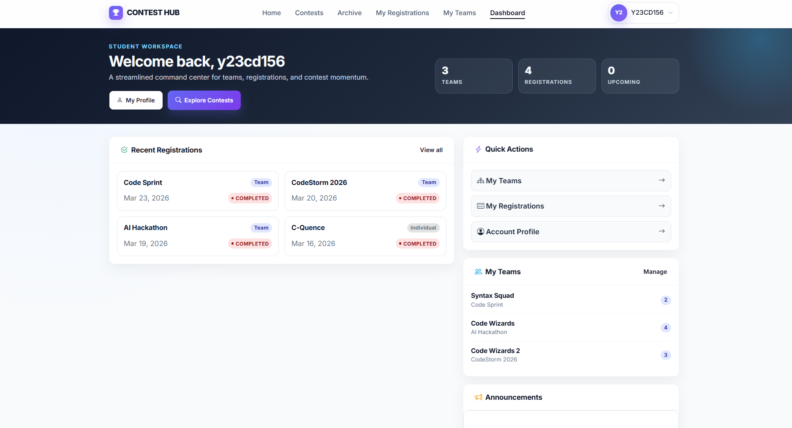
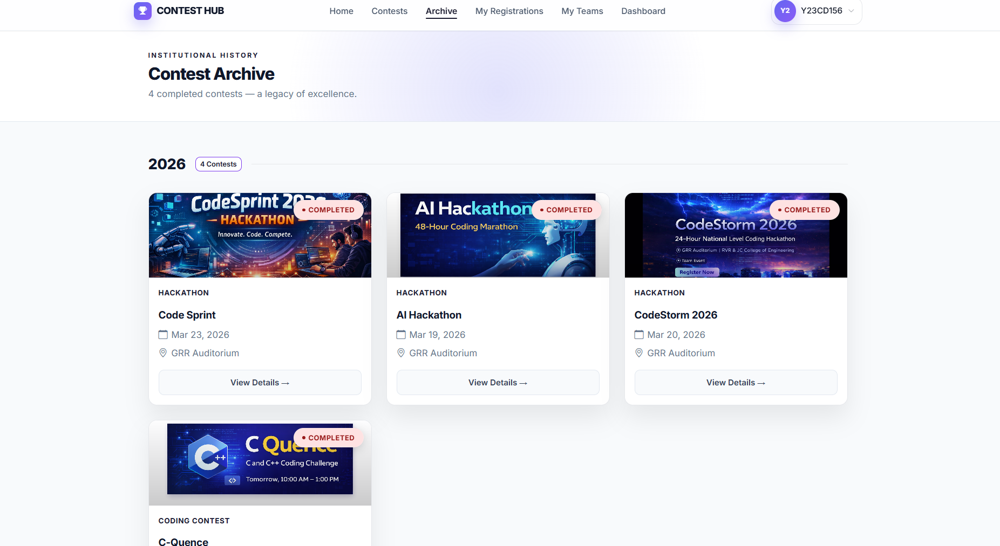
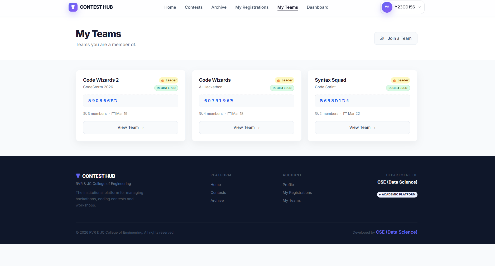

# 🎯 Contest Hub

<p align="center">
  
  
  
  
</p>

<p align="center">
  <b>🚀 Built for academic excellence, real-world scalability, and placement-ready portfolio</b>
</p>

### Web-Based Contest Registration and Management System

A modern full-stack Django application built to efficiently manage college-level hackathons and coding contests with role-based access, team collaboration, and seamless registration workflows.

---

## 🚀 Features

* 🔐 User Authentication (Admin & Student Roles)
* 🧑‍💼 Admin Dashboard for Contest Management
* 🎓 Student Dashboard with Contest Overview
* 👥 Team Creation & Join via Unique Code
* 📝 Contest Registration System
* 📂 Bulk User Upload using CSV
* 📢 Announcements & Notifications
* 🎨 Clean, Responsive UI (Bootstrap आधारित)

---

## 🏗️ System Architecture

* **Frontend:** HTML, CSS, Bootstrap, JavaScript
* **Backend:** Django (Python)
* **Database:** PostgreSQL (Production), SQLite (Development)
* **ORM:** Django ORM

---

<h2 align="center">📸 Screenshots</h2>

<h3 align="center">🏠 Home</h3>
<p align="center">
  
</p>

<h3 align="center">📊 Dashboard</h3>
<p align="center">
  
</p>

<h3 align="center">📁 Archive</h3>
<p align="center">
  
</p>

<h3 align="center">👥 Teams</h3>
<p align="center">
  
</p>

---

## ⚙️ Installation & Setup

### 1️⃣ Clone the repository

```bash
git clone https://github.com/ravuribhargav/contest-hub.git
cd contest-hub
```

### 2️⃣ Create virtual environment

```bash
python -m venv venv
venv\Scripts\activate
```

### 3️⃣ Install dependencies

```bash
pip install -r requirements.txt
```

### 4️⃣ Apply migrations

```bash
python manage.py makemigrations
python manage.py migrate
```

### 5️⃣ Run development server

```bash
python manage.py runserver
```

---

## 🧩 Project Modules

* **Accounts** → Authentication, user roles, profiles
* **Contests** → Contest creation, scheduling, status
* **Teams** → Team creation, join via secure code
* **Registrations** → Contest registration logic
* **Admin Panel** → Full control over users & contests
* **Announcements** → Broadcast updates to users

---

## 💡 Key Highlights

* ✔ Role-Based Access Control
* ✔ Secure Team Join Code System
* ✔ Clean & Modern UI Design
* ✔ Scalable Django Architecture
* ✔ Suitable for Academic & Real-world Use

---

## 🔮 Future Enhancements

* 📧 Email Notifications
* 🏆 Leaderboard & Result System
* ☁️ Deployment (AWS / Render)
* 🔗 REST API Integration
* 📊 Analytics Dashboard

---

## 👨‍💻 Author

**Ravuri Bhargav**
📧 [ravuribhargav22@gmail.com](mailto:ravuribhargav22@gmail.com)
🔗 GitHub: https://github.com/ravuribhargav

---

## ⭐ Support

If you found this project useful, consider giving it a ⭐ on GitHub!
